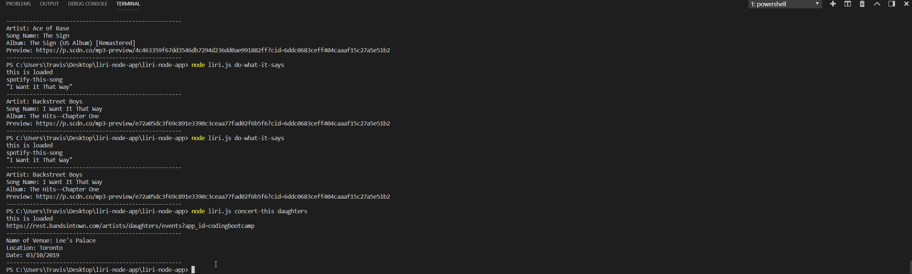
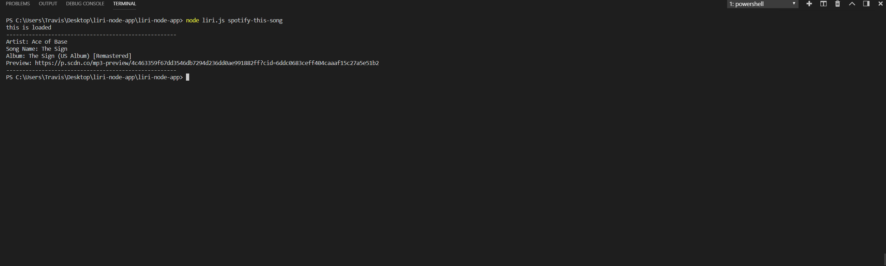
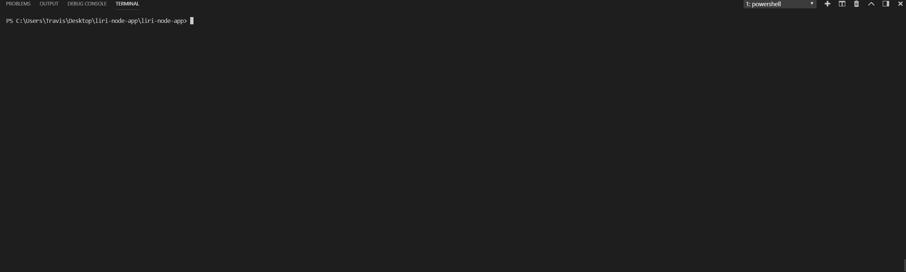

# liri-node-app

LIRI (Language Interpretation and Recognition Interface) is a command line node app that takes in parameters and gives you back data.
 
 
LIRI can search Spotify for songs, Bands in Town for concerts, and OMDB for movies.
 
Data is retrieved by sending requests using the axios node package to the Bands in Town, Spotify, and OMDB APIs.
 
 
<strong>Technologies used:</strong>  
<a href="https://www.npmjs.com/package/axios">Axios</a>  
<a href="https://www.npmjs.com/package/moment">MomentJS</a>  
<a href="https://www.npmjs.com/package/node-spotify-api">Node Spotify API</a>  
<a href="http://www.omdbapi.com/">OMDB API</a>  
<a href="https://manager.bandsintown.com/support/bandsintown-api">Bands in Town API</a> 
 
Below are GIFS of each command in action:
 
 
Get Upcoming Concert Information Using:
 
node liri.js concert-this [artist/band name here]
 

 
 

Get Spotify Song Information Using:
 
node liri.js spotify-this-song [song name here]
 

 
 

Get Movie Information Using:
 
node liri.js movie-this [movie name here]
 

 
 

Do What it Says in the Log Using:
 
node liri.js do-what-it-says
 

 

